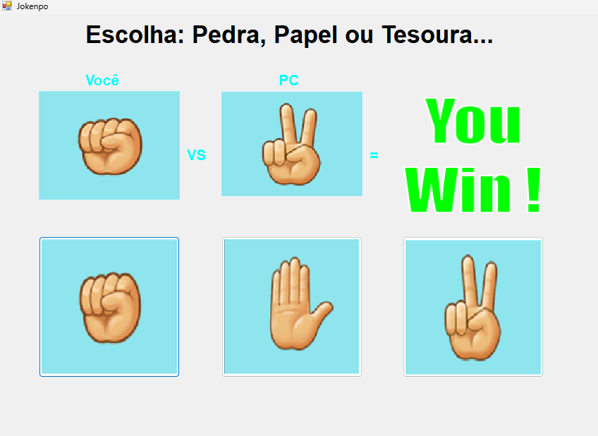

# 🪨📄✂️ Jokempô – Pedra, Papel e Tesoura (C# WinForms)

## Aplicativo Jokempô (Pedra, Papel e Tesoura) desenvolvido em C# com Windows Forms, onde o jogador compete contra o computador em uma interface gráfica simples e intuitiva.

## 🎮 Funcionalidades

Interface gráfica feita com Windows Forms

Escolha entre:

🪨 Pedra

📄 Papel

✂️ Tesoura

Jogada aleatória do computador

Exibição visual das escolhas

Resultado automático:

Vitória

Derrota

Empate

--

## 🖼️ Interface

O aplicativo possui:

Área para escolha do jogador

Área para escolha do computador

Indicação visual do resultado da rodada

Interface simples e ideal para aprendizado de lógica e WinForms.

## 🛠️ Tecnologias Utilizadas

C#

.NET Framework

Windows Forms (WinForms)

Visual Studio

--

## ▶️ Como Executar o Projeto

Clone o repositório:

git clone https://github.com/andrewSouza-dev/Jokempo.git

Abra o arquivo:

Jokempo.sln

no Visual Studio

Execute o projeto:

Pressione F5

Ou clique em Iniciar

🎯 Objetivo do Projeto

Este projeto foi criado com o objetivo de:

Praticar C#

Aprender Windows Forms

Aplicar lógica de programação

Trabalhar com eventos e interface gráfica

--

## 📌 Melhorias Futuras (Ideias)

Contador de vitórias, derrotas e empates

Sistema de reinício de partida

Animações

Sons

Modo melhor de 3 / melhor de 5

## 📄 Licença

Este projeto está sob a licença MIT.
Sinta-se livre para usar, modificar e estudar.

## 👤 Autor

Andrew Souza
🔗 GitHub: andrewSouza-dev
